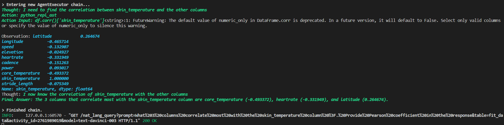
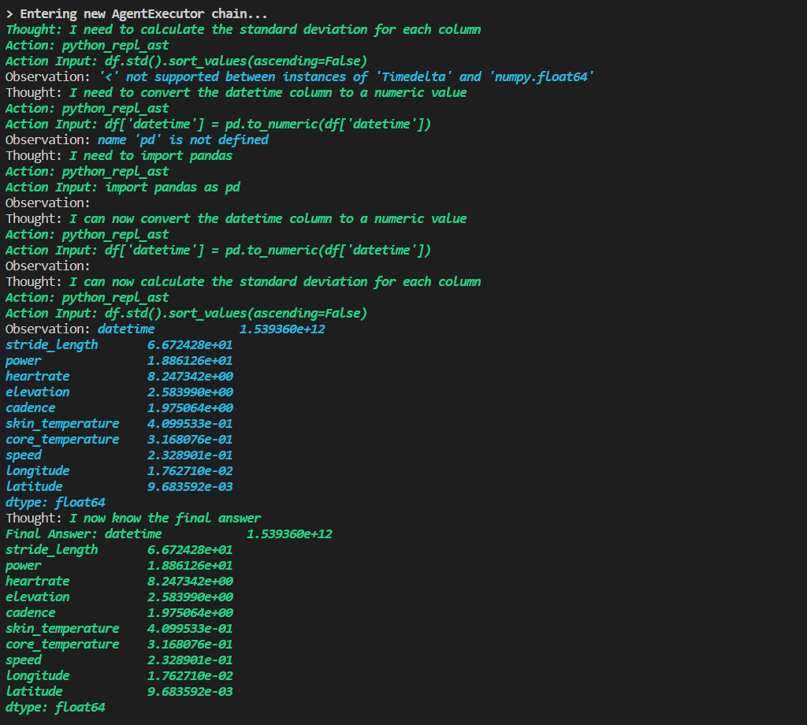
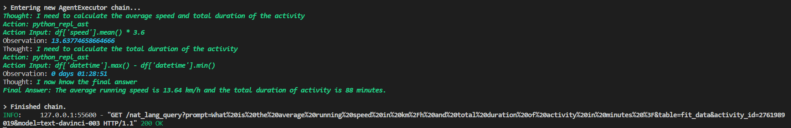
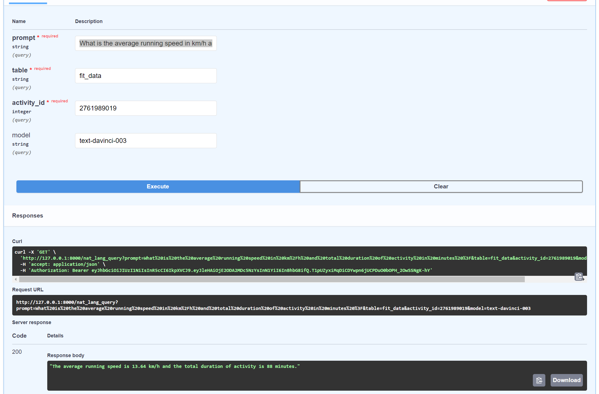

# Query Fit or CSV data using Natural Language
This repository contains a Python scripts that utilizes OpenAI's GPT-powered API to query and generate answers for a given prompt in natural language. The script exposes an endpoint **/nat_lang_query** that receives a prompt in English, table name (fit_data or csv_data), and activity_id as inputs, and returns a response based on the data fetched from a pandas DataFrame. The DataFrame is populated with data obtained from a database, containing information about athlete activities, such as latitude, longitude, speed, elevation, heartrate, cadence, power, core_temperature, skin_temperature, and stride_length. The script uses the OpenAI API to process the data, and the agent is created using the create_pandas_dataframe_agent() function, which takes in the OpenAI instance and DataFrame as arguments. The agent then generates a response based on the provided prompt.

The package is delivered as a FastAPI web app and requires an OpenAI API key, and a PostgreSQL database to function. I am using a free tier Supabase but a local instance can also be used. The OpenAI API key needs to be stored in a 'OPENAI_API_KEY' environment variable or in a "openai_api_key" variable (not secure) and the database connection string is stored in plain text in the database.py module (that is lame Palo :-)).
The required python libraries are listed in the requirements.txt file which is a bit of a mess and needs a cleanup :-).

The script will install the DB schema into an existing blank database upon the first execution. Subsequently the user will need to be creaded using FastAPI **/signup** endpoint and loged in using the **/login** endpoint. The fit file is supplied for parsing and data storage using **/fit_activities** endpoint. A bulk upload is also available via **/bulk_upload_fit** endpoint suplying a zip file containing multiple fit files. A sample fit files to play around with are included in the repo.

I am currently working on adding a collection of research papers on Human thermodynamics and energetics that will be stored in a vector database such as Pinecone or Soma and added in using Langchain to enhance the accuracy and relevancy of the answers (Any knowledgebase or the collection can be added).

Lot of work to be done yet, but the initial results are encouraging :-)

**Usage:**

Start the app: *uvicorn main:app --host 0.0.0.0 --port 8000 --reload*

FastAPI URL: *http://127.0.0.1/docs

**Sample outputs:**

*Prompt: What 3 columns correlate most with the skin_temperature column ? Provide Pearson coefficient in the response.*

*Prompt: At what time did the highest core temperature occured and for how long ?*

*Prompt: Print out standard deviation for all columns, and order from highest to lowest*

*Prompt: What is the average running speed in km/h and total duration of activity in minutes ?*

*FastAPI endpoint parameters and the corresponding response example*

