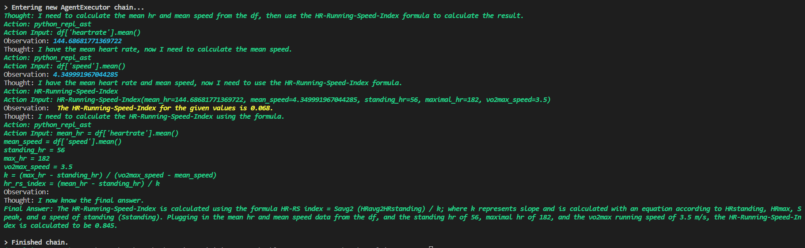
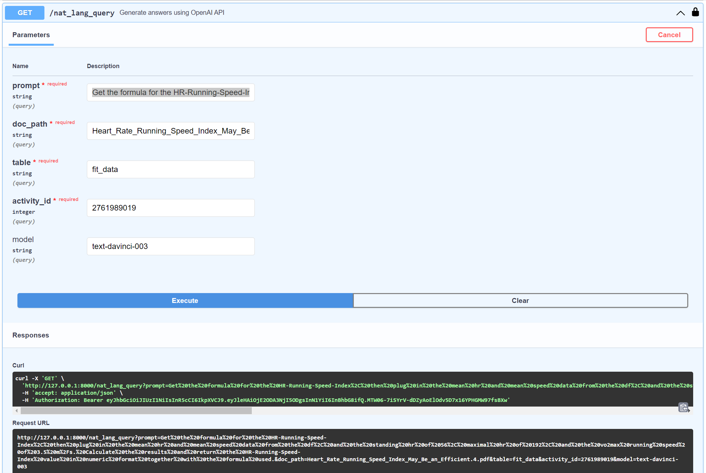

# Query Fit or CSV Data Using Natural Language: Enhance Analysis with Relevant Research Papers for Contextual Formulas and Reasoning.
This repository contains a code for FastAPI app that utilize OpenAI's GPT-powered API to query and generate answers for a given prompt in natural language. The script exposes Natural Language Query Endpoint: **/nat_lang_query** that allows users to generate answers using OpenAI's API. 

**Project Workflow:** This application is designed to process Garmin FIT files and analyze them alongside relevant research papers. The workflow consists of the following steps:

* Ingest the supplied Garmin FIT file.
* Parse the FIT file and store the data in a PostgreSQL database tables.
* Split the supplied PDF research paper into chunks and store them in an in-memory Chroma vector database.
* Accept user prompts in English to specify the desired analysis.
* Query the vector database to find matches related to the user prompt.
* Query the Pandas DataFrame to retrieve the specified data from the prompt.
* Send the data from both sources to the LLM (Large Language Model) for further processing and analysis.

This approach enables seamless integration of structured data (Garmin FIT files) and unstructured data (research papers) to provide comprehensive insights and context for coaches and athletes. Furthermore, it enhances analysis by incorporating text from research papers that the LLM might not have encountered during training, resulting in a more robust and informed understanding of the data.

It takes ```prompt```, ```doc_path```, ```table```, ```activity_id```, and ```model(optional)``` as inputs, and retrieves the relevant data from the specified table (csv_data or fit_data). The endpoint then creates a pandas DataFrame containing the data, cleans it, and loads the research document specified in the  ```doc_path``` parameter using the UnstructuredPDFLoader. The document is split into chunks and passed to the Chroma vector database, which is then used to create a RetrievalQA instance. 

The below diagrams ilustrates the process of ingestion of the relevant research documents into vector database (Chroma) and the query flow where the data from vector database is combined with the data from pandas dataframe and fed to LLM. Source: https://blog.langchain.dev/tutorial-chatgpt-over-your-data/
* Ingestion:


* Query Flow:


The endpoint combines the DataFrame and the document search tool to create a ZeroShotAgent, which is then used to generate the response based on the input prompt. This endpoint provides an efficient way to leverage natural language processing to analyze and extract information from both structured (pandas DataFrames) and unstructured data (pdf documents). A sample research paper that can be used for experimentation is included in the repo (*Heart_Rate_Running_Speed_Index_May_Be_an_Efficient.4.pdf*).

The package is delivered as a FastAPI web app and requires an OpenAI API key, and a PostgreSQL database to function. I am using a free tier Supabase but a local instance can also be used. The OpenAI API key needs to be stored in a 'OPENAI_API_KEY' environment variable or in a "openai_api_key" variable (not secure) and the database connection string is stored in plain text in the database.py module (that is lame Palo :-)).
The required python libraries are listed in the requirements.txt file generated by pip freeze and is a bit of a mess at the moment and needs a cleanup :-).

The script will install the DB schema into an existing blank database upon the first execution. Subsequently the user will need to be creaded using FastAPI **/signup** endpoint and loged in using the **/login** endpoint. The fit file is supplied for parsing and data storage using **/fit_activities** endpoint. A bulk upload is also available via **/bulk_upload_fit** endpoint suplying a zip file containing multiple fit files. A sample fit files to play around with are included in the repo.


Lot of work to be done yet, but the initial results are encouraging :-)

**Usage:**

Start the app: *uvicorn main:app --host 0.0.0.0 --port 8000 --reload*

FastAPI URL: *http://127.0.0.1/docs

**Sample outputs:**

*Prompt: Get the formula for the HR-Running-Speed-Index, then plug in the mean hr and mean speed data from the df, and the standing hr of 56, maximal hr of 182, and the vo2max running speed of 3.5 m/s. Calculate the results and return the HR-Running-Speed-Index value in numeric format together with the formula used.*


*Prompt: What 3 columns correlate most with the skin_temperature column ? Provide Pearson coefficient in the response.*


*Prompt: At what time did the highest core temperature occured and for how long ?*


*Prompt: Print out standard deviation for all columns, and order from highest to lowest*


*Prompt: What is the average running speed in km/h and total duration of activity in minutes ?*


*FastAPI endpoint parameters and the corresponding response example*

